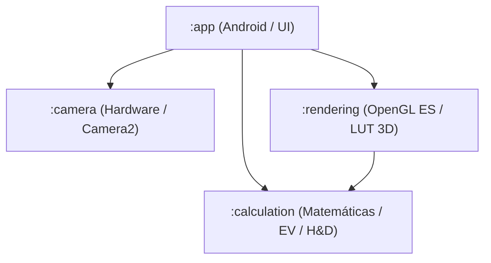

# xFilm 🎞️

**xFilm** es una aplicación de simulación de película analógica en tiempo real y exposímetro para Android. Está diseñada para capturar la esencia de la fotografía analógica mediante la aplicación de curvas densitométricas reales sobre la vista previa de la cámara, y al mismo tiempo servir como asistente de medición de luz (exposímetro) para cámaras analógicas clásicas.

La aplicación está construida sobre una arquitectura modular moderna en **Kotlin** utilizando **Jetpack Compose**, **Camera2 API** y **OpenGL ES 3.0**.

---

## 🚀 Características Principales

### 1. Gradación de Color mediante LUT 3D en Tiempo Real
* **Procesamiento por GPU**: Mediante shaders en **GLSL ES 3.0**, la señal de la cámara se mapea en tiempo real utilizando una textura 3D de tabla de búsqueda (3D LUT) de $32^3$ elementos.
* **Interpolación Trilineal**: Mapeo suave y de alto rendimiento que evita artefactos visuales en los bordes cromáticos.

### 2. Curvas de Emulsión Hurter-Driffield (H&D)
Aproximación matemática paramétrica de la respuesta química de las emulsiones fotográficas:
* **Zonas Replicadas**:
  * *Toe* (Compresión de sombras / negros elevados).
  * *Linear* (Gama media de contraste neutro).
  * *Shoulder* (Rolloff suave de altas luces / preservación de blancos).
* **Emulaciones de Película Disponibles**:
  * **Kodak Tri-X 400**: Película clásica de blanco y negro, alto contraste y negros marcados.
  * **Kodak Portra 400**: Película negativa a color conocida por sus tonos cálidos y sombras suaves.
  * **Fujifilm Velvia 50**: Película de diapositiva (slide) de alta saturación y negros profundos.

### 3. Exposímetro en Tiempo Real (Calculadora de EV)
* **Cálculo de EV**: Calcula el Valor de Exposición ($EV_{100}$) a partir de los metadatos de apertura, velocidad de obturación e ISO capturados por el sensor móvil.
* **Luminancia Estimada**: Conversión del valor EV a iluminancia aproximada de la escena en Lux.
* **Reglas Incorporadas**: Soporta calibración y validación basada en reglas tradicionales (Sunny 16, Cloudy 11, Indoor).

### 4. Traductor a Parámetros de Cámara Analógica (Pentax K1000)
* Traduce el EV de la escena en combinaciones físicas reales configurables en una cámara réflex mecánica clásica (Pentax K1000) a **ASA 100**:
  * **Aperturas fijas**: f/2, f/2.8, f/4, f/5.6, f/8, f/11, f/16.
  * **Velocidades de obturación**: Desde 1" (segundo) hasta 1/1000s.
* Ofrece tres variantes de sugerencias en la interfaz:
  1. *Apertura abierta* (poca profundidad de campo).
  2. *Apertura estándar* (nitidez óptima).
  3. *Apertura cerrada* (gran profundidad de campo).

---

## 🛠️ Arquitectura del Proyecto

El proyecto está dividido en 4 módulos Gradle para garantizar una clara separación de responsabilidades y facilitar las pruebas unitarias:

* **`:app`**: Capa de presentación en Android Studio. Implementa la UI interactiva mediante Jetpack Compose (`CameraScreen`), el flujo de datos del estado con `CameraViewModel` y la inyección de dependencias.
* **`:camera`**: Abstracción del hardware de la cámara utilizando `Camera2`. Administra el ciclo de vida del sensor, detecta los límites del hardware (`CameraCapabilities`), la compatibilidad con formato RAW y extrae metadatos de exposición en tiempo real.
* **`:calculation`**: Módulo multiplataforma de Kotlin puro. Realiza los cálculos de exposición y traduce el EV a presets de cámaras analógicas. Define los modelos matemáticos de la curva H&D.
* **`:rendering`**: Motor de renderizado gráfico de OpenGL. Genera los buffers 3D LUT en base a las curvas H&D, compila los shaders de fragmentos y vértices, y dibuja la vista previa procesada a través de un `LutGlSurfaceView`.

---

## 📋 Requisitos y Tecnologías

* **S.O. Mínimo**: Android 8.0 (API 26) o superior.
* **Soporte de GPU**: OpenGL ES 3.0.
* **Lenguaje**: Kotlin 1.9+.
* **UI**: Jetpack Compose con Material 3.
* **Build System**: Gradle con Kotlin DSL (`.gradle.kts`).
